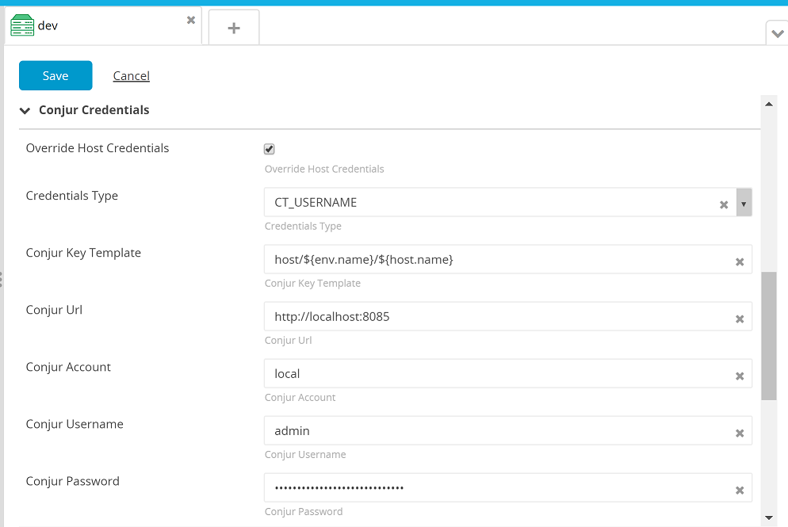

# CyberArk Conjur Host Plugin #

## Overview ##

The Conjur Host Plugin allows you to specify overthere.Host credentials that are used only for a particular deployment.

The following features are available : 

- specify a username/password couple (CredentialsType.CT_USERNAME)
- specify a private key file path and a passphrase (CredentialsType.CT_PRIVATEKEY)
- optionally insert a check connection step for each hosts involved in the deployment plan

Note: Adapted from xld-personal-credentials-plugin

## Requirements ##

* **XLDeploy requirements**
	* **XLDeploy**: version 7.0.0+

## Installation ##

Place the plugin .xldp file into your `SERVER_HOME/plugins` directory.

## Configuration ##

Once the plugin is installed, environments will have additional properties as outlined below.  The activation of the Conjur credential is triggered per environment using the _overrideHostCredentials_ property.  Select the _overrideHostCredentials_ and complete the remaining fields to enable host credential substitution at deployment time.



### Override Host Credentials ###

### Credentials Type ###
	
#### CT_USERNAME ####

This configuration the plugin will call Conjur to get a username and password for the host.  These credentials will be used each time XLDeploy needs to create a new remote connection to a host during the execution of the deployment plan.

#### CT_PRIVATEKEY ####

In this configuration the plugin will call Conjur get the privatekey filename and the passphrase property of the concerned overthere.Host(s).

### Conjur Key Template ###

The key template determines the Conjur path to the secret.  The following context variables are available to you to construct the key:

* app.name
* env.name
* host.name
* host.address
* host.username

Both CT_USERNAME and CT_PRIVATEKEY read two variables from Conjur.  These are appended to the resultant key path automatically:

* **CT_USERNAME**
	* host/\<key path\>/username
	* host/\<key path\>/password
* **CT_PRIVATEKEY**
	* host/\<key path\>/privateKeyFile
	* host/\<key path\>/passphrase

#### Example: ####
 
The simplest key template might be:

```
host/<host.name>
```

If the host name were 'vm123' and the Credential Type is CT_USERNAME, this would result in these two variable keys:

```
host/vm123/username
host/vm123/password
```

### Conjur URL ###

The URL to your Conjur Server.  The value should include the protocol.  E.g. http:// or https://.

### Conjur Account ###

The Conjur account or namespace that holds the variables.

### Conjur Username ###

The username XL Deploy will use to authenticate to the Conjur server.

### Conjur Password ###

The password XL Deploy will use to authenticate to the Conjur server.

### Check Connection ###

If true, XL Deploy will check connection to the host with the credentials supplied by Conjur before the deployment begins.

## Notes ##
- The 'checkConnection' property allows to generate CheckConnection Step on all the hosts involved in the Conjur credentials process.
- Use _gradlew clean build_ for gradle build
