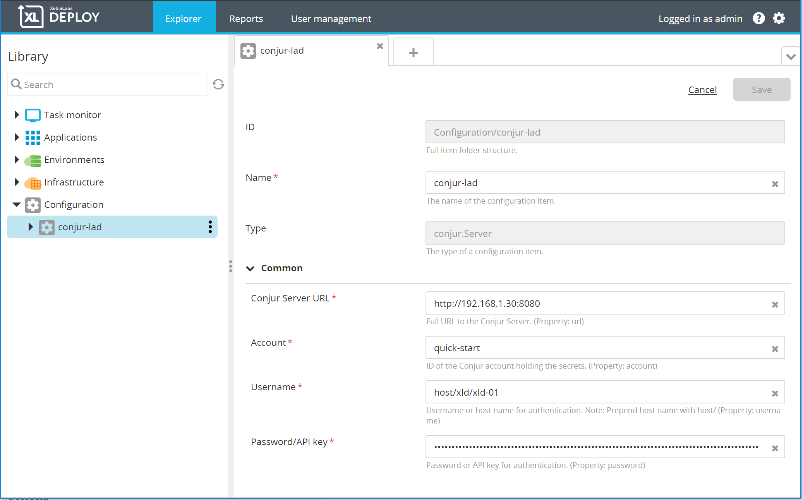
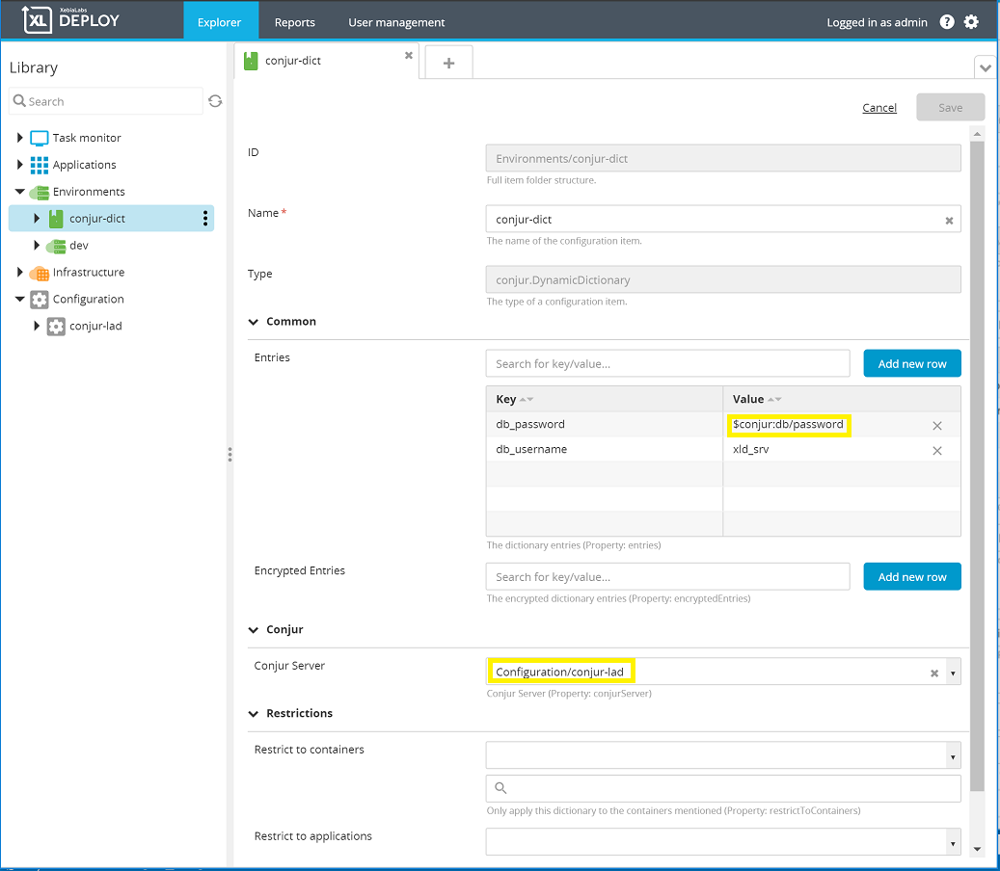
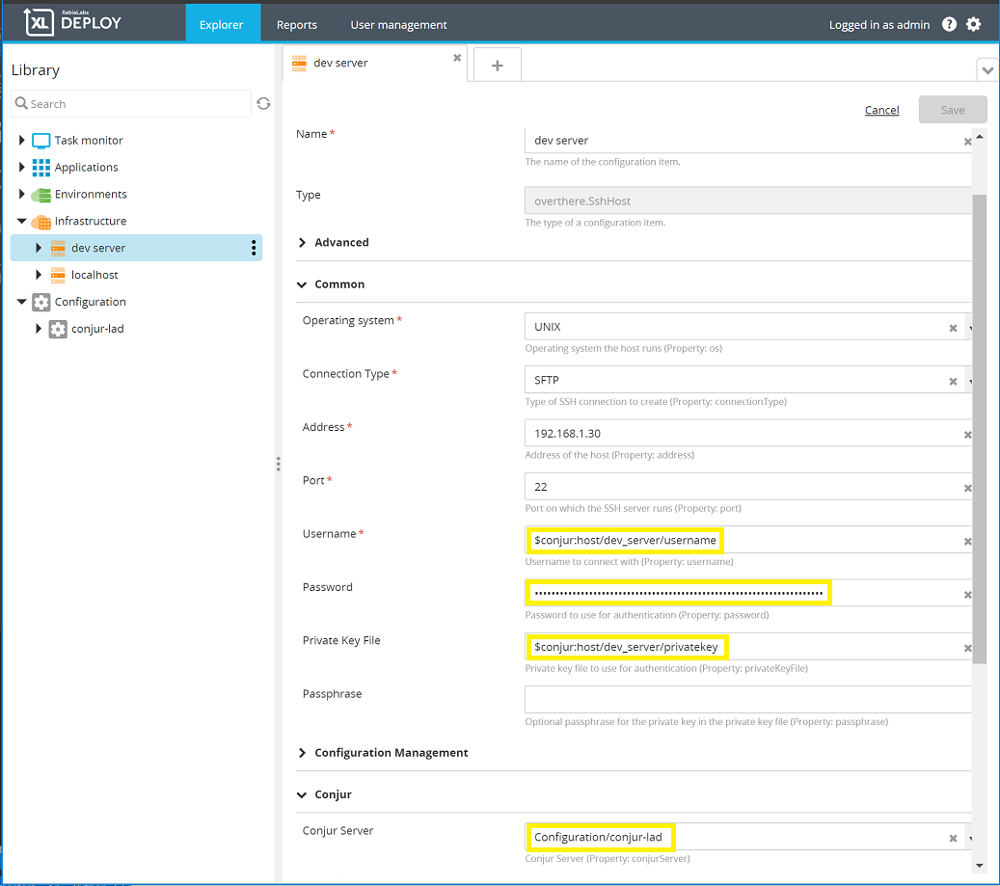

# XLD Conjur Plugin #

[![Build Status][xld-conjur-plugin-travis-image]][xld-conjur-plugin-travis-url]
[![License: MIT][xld-conjur-plugin-license-image]][xld-conjur-plugin-license-url]
![Github All Releases][xld-conjur-plugin-downloads-image]

[xld-conjur-plugin-travis-image]: https://travis-ci.org/xebialabs-community/xld-conjur-plugin.svg?branch=master
[xld-conjur-plugin-travis-url]: https://travis-ci.org/xebialabs-community/xld-conjur-plugin
[xld-conjur-plugin-license-image]: https://img.shields.io/badge/License-MIT-yellow.svg
[xld-conjur-plugin-license-url]: https://opensource.org/licenses/MIT
[xld-conjur-plugin-downloads-image]: https://img.shields.io/github/downloads/xebialabs-community/xld-conjur-plugin/total.svg

## Overview ##

The Conjur Plugin adds two capabilities to XL Deploy:

* New DynamicDictionary to __Environments__
* Retrieve credentials for __overthere.Hosts__

## Requirements ##

* **XLDeploy**: version 8.0.0+
* **Cyberark Conjur**: version 5.0+

## Installation ##

Place the plugin .xldp file into your `SERVER_HOME/plugins` directory.

## Configuration ##

Begin by configuring a Conjur server in the Configuration repository.



### Conjur URL ###

The URL to your Conjur Server.  The value should include the protocol e.g. http:// or https://.

### Conjur Account ###

The Conjur account or namespace that holds the variables.

### Conjur Username ###

The username XL Deploy will use to authenticate to the Conjur server.

### Conjur Password / API Key ###

The password or API Key XL Deploy will use to authenticate to the Conjur server.

### Control Task : Check Connection ###

The Conjur Plugin will check connection to the Conjur host with the credentials supplied.

## DynamicDictionary ##

The Conjur DynamicDictionary is available under __Environments -> New -> Conjur -> DynamicDictionary__.  It behaves like a regular dictionary with the added feature that values can be looked up on Conjur at deployment time.  An entry that has a Conjur lookup for its value has the form:

```
$conjur:<key path>
```



At deployment time, when the dictionary is used for property placeholder substitution in the application, any key value that starts with '$conjur:' is a signal to the application to lookup the value in the associated Conjur server.  The plugin will lookup the Conjur value using the supplied key path and place that value in the dictionary.  Note that this is runtime behavior.  The values are looked up and supplied when values are retrieved from the dictionary.  The dictionary itself is not modified.

### Conjur Server ###

Indicate the Conjur Server to use for lookups.

### Control Task : Test Dictionary ###

The Conjur Plugin will call the Conjur server and attempt to retrieve values.  If any key referenced in the dictionary cannot be found in Conjur, an error will be raised.

## Host Credentials ##

Any __Infrastructure__ host-type that has __overthere.Host__ as its parent (e.g. overthere.SshHost or overthere.SmbHost), can now use Conjur values for any of its properties.



Like the DynamicDictionary, instead of entering the actual value, enter '$conjur:\<key path\>'.  (Note that password fields will not show the entry as in the example above.)  During the deployment process, the plugin will retrieve the values from Conjur.

### Conjur Server ###

Indicate the Conjur Server to use for lookups.

## Developer Notes ##

* Set __xlDeployHome__ in __gradle.properties__ to your local XL Deploy instance.  Some XL Deploy packages are needed for the plugin to compile.
